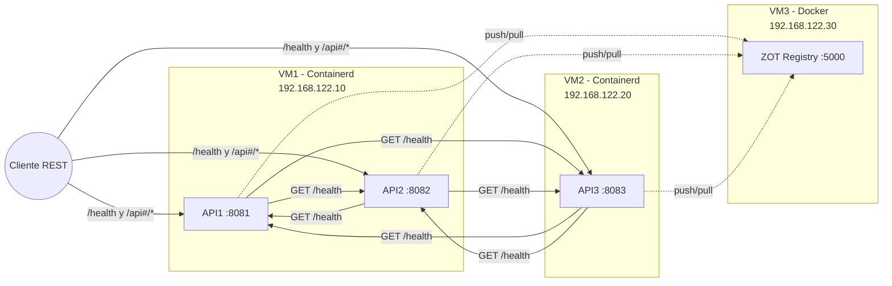

# Manual Técnico

## 1. Diagrama de Arquitectura

---

## 2. Descripción de Herramientas

- **Go (Golang)**: Lenguaje de programación usado para implementar las APIs REST. Permite binarios estáticos para contenedores livianos.
- **KVM/QEMU**: Motor de virtualización utilizado para levantar las 3 VMs del proyecto.
- **Containerd**: Runtime en VM1 y VM2 para ejecutar los contenedores de API1, API2 y API3.
- **Docker Engine**: Runtime en VM3 para levantar el contenedor de ZOT Registry.
- **ZOT Registry**: Registro privado OCI usado para almacenar y distribuir imágenes de contenedores dentro del entorno aislado.

---

## 3. Explicación del Código

### 3.1 Endpoint `/health`
- Implementado en cada API con `healthHandler`.
- Responde JSON con `status`, `message`, `timestamp`, `VM` y `carnet`.
- Se valida el método `GET` y se envía `status: "UP"` cuando la API está operativa.

### 3.2 Endpoints de comunicación entre APIs
- Rutas (por API):
  - API1: `/api1/202300625/call-api2`, `/api1/202300625/call-api3`
  - API2: `/api2/202300625/call-api1`, `/api2/202300625/call-api3`
  - API3: `/api3/202300625/call-api1`, `/api3/202300625/call-api2`
- Flujo interno:
  1. Se hace `GET` al `/health` de la API destino.
  2. Si la respuesta es HTTP 200 y `status == "UP"`, se devuelve `connection: true`.
  3. En caso de error o status no esperado, se devuelve `connection: false`.

### 3.3 Manejo de fallos
- Si la API destino no responde, o responde con error, se retorna:
  - `message: "ERROR: The API# located on the VM# is not working"`
  - `connection: false`
- Esto permite evidenciar el manejo de errores cuando un nodo está caído.

---

## 4. Configuración del Entorno (VMs)

### VM1: Containerd (API1 y API2)
- **OS**: Debian 13 Trixie
- **CPU**: 2 cores
- **RAM**: 2 GB
- **Disco**: 20 GB
- **Red**: Bridge – 192.168.122.10

### VM2: Containerd (API3)
- **OS**: Debian 13 Trixie
- **CPU**: 2 cores
- **RAM**: 2 GB
- **Disco**: 20 GB
- **Red**: Bridge – 192.168.122.20

### VM3: Docker (ZOT Registry)
- **OS**: Debian 13 Trixie
- **CPU**: 2 cores
- **RAM**: 2 GB
- **Disco**: 20 GB
- **Red**: Bridge – 192.168.122.30

---

## 5. Referencias Cruzadas
- Documentación de comunicación entre APIs: [docs/api-docs/COMUNICACION_APIS.md](../api-docs/COMUNICACION_APIS.md)
- Scripts de despliegue: [scripts/container-deployment/deploy.sh](../../scripts/container-deployment/deploy.sh)
- Configuración de VMs: [vm-config/README.md](../../vm-config/README.md)
