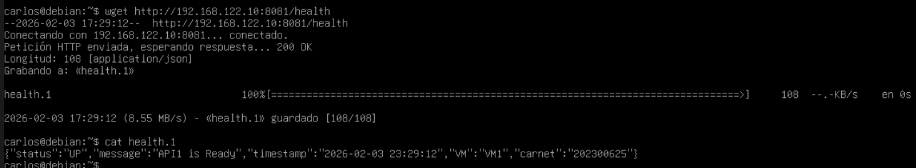
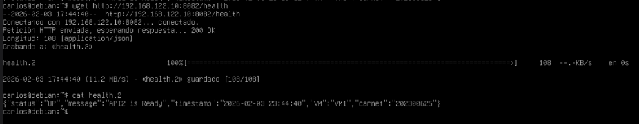
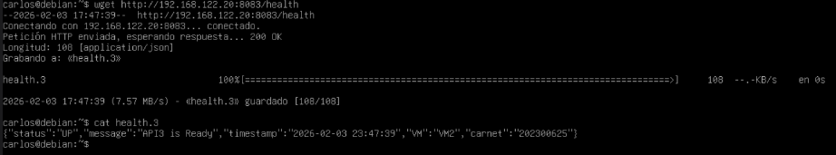
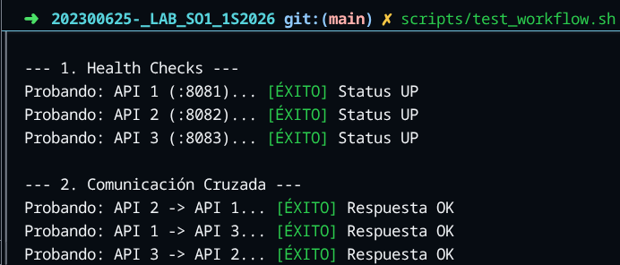

# Evidencia Completa de Pruebas Funcionales

**Proyecto:** Desarrollo, Conexión y Gestión de Contenedores en Entornos Virtualizados  
**Carnet:** 202300625  
**Fecha:** Febrero 2026  
**Universidad San Carlos de Guatemala**

---

## Tabla de Contenidos

1. [Resumen Ejecutivo](#resumen-ejecutivo)
2. [Endpoints /health](#endpoints-health)
3. [Comunicación entre APIs](#comunicación-entre-apis)
4. [Manejo de Errores](#manejo-de-errores)
5. [Pruebas de Registro (Zot)](#pruebas-de-registro-zot)
6. [Logs de Ejecución](#logs-de-ejecución)
7. [Checklist Final](#checklist-final)

---

## Resumen Ejecutivo

Este documento contiene la evidencia de todas las pruebas funcionales realizadas al sistema. Incluye:

- **3 APIs REST** ejecutándose en Go
- **Comunicación de 6 direcciones** entre APIs (cada API llama a las otras 2)
- **Manejo robusto de errores** cuando un nodo no está disponible
- **Registro privado Zot** para almacenamiento de imágenes

---

## Endpoints /health

## Endpoints /health

Estos endpoints verifican que cada API esté operativa y lista para recibir solicitudes.

### API1 - Health Check

**URL:** `http://192.168.122.10:8081/health`  
**Método:** GET  
**Descripción:** Verifica el estado de operación de API1 en VM1

**Respuesta esperada:**
```json
{
  "status": "UP",
  "message": "API1 is Ready",
  "timestamp": "2026-02-02T10:30:00Z",
  "VM": "VM1",
  "carnet": "202300625"
}
```

**Comando de prueba:**
```bash
curl -s http://192.168.122.10:8081/health | jq .
```

**Evidencia:**


---

### API2 - Health Check

**URL:** `http://192.168.122.10:8082/health`  
**Método:** GET  
**Descripción:** Verifica el estado de operación de API2 en VM1

**Respuesta esperada:**
```json
{
  "status": "UP",
  "message": "API2 is Ready",
  "timestamp": "2026-02-02T10:31:00Z",
  "VM": "VM1",
  "carnet": "202300625"
}
```

**Comando de prueba:**
```bash
curl -s http://192.168.122.10:8082/health | jq .
```

**Evidencia:**




---

### API3 - Health Check

**URL:** `http://192.168.122.20:8083/health`  
**Método:** GET  
**Descripción:** Verifica el estado de operación de API3 en VM2

**Respuesta esperada:**
```json
{
  "status": "UP",
  "message": "API3 is Ready",
  "timestamp": "2026-02-02T10:32:00Z",
  "VM": "VM2",
  "carnet": "202300625"
}
```

**Comando de prueba:**
```bash
curl -s http://192.168.122.20:8083/health | jq .
```

**Evidencia:**



---

## Comunicación entre APIs

### Matriz de Comunicación

| Origen | Destino | URL | Estado esperado |
|--------|---------|-----|-----------------|
| API1 | API2 | /api1/202300625/call-api2 | ✓ connection: true |
| API1 | API3 | /api1/202300625/call-api3 | ✓ connection: true |
| API2 | API1 | /api2/202300625/call-api1 | ✓ connection: true |
| API2 | API3 | /api2/202300625/call-api3 | ✓ connection: true |
| API3 | API1 | /api3/202300625/call-api1 | ✓ connection: true |
| API3 | API2 | /api3/202300625/call-api2 | ✓ connection: true |

---

### Prueba 1: API1 → API2

**URL:** `http://192.168.122.10:8081/api1/202300625/call-api2`  
**Método:** GET  
**Descripción:** API1 verifica si API2 está operativa

**Respuesta esperada (éxito):**
```json
{
  "apiname": "API2",
  "message": "The API2 located on the VM1 is working",
  "connection": true,
  "carnet": "202300625"
}
```

**Comando de prueba:**
```bash
curl -s http://192.168.122.10:8081/api1/202300625/call-api2 | jq .
```

**Evidencia:**
- [ ] Captura: `docs/operations/assets/api1-call-api2-ok.png`
- [ ] Log: `logs/api1-call-api2-ok.log`

---

### Prueba 2: API1 → API3

**URL:** `http://192.168.122.10:8081/api1/202300625/call-api3`  
**Método:** GET  
**Descripción:** API1 verifica si API3 está operativa (en VM2)

**Respuesta esperada (éxito):**
```json
{
  "apiname": "API3",
  "message": "The API3 located on the VM2 is working",
  "connection": true,
  "carnet": "202300625"
}
```

**Comando de prueba:**
```bash
curl -s http://192.168.122.10:8081/api1/202300625/call-api3 | jq .
```

**Evidencia:**
- [ ] Captura: `docs/operations/assets/api1-call-api3-ok.png`
- [ ] Log: `logs/api1-call-api3-ok.log`

---

### Prueba 3: API2 → API1

**URL:** `http://192.168.122.10:8082/api2/202300625/call-api1`  
**Método:** GET  
**Descripción:** API2 verifica si API1 está operativa

**Respuesta esperada (éxito):**
```json
{
  "apiname": "API1",
  "message": "The API1 located on the VM1 is working",
  "connection": true,
  "carnet": "202300625"
}
```

**Comando de prueba:**
```bash
curl -s http://192.168.122.10:8082/api2/202300625/call-api1 | jq .
```

**Evidencia:**
- [ ] Captura: `docs/operations/assets/api2-call-api1-ok.png`
- [ ] Log: `logs/api2-call-api1-ok.log`

---

### Prueba 4: API2 → API3

**URL:** `http://192.168.122.10:8082/api2/202300625/call-api3`  
**Método:** GET  
**Descripción:** API2 verifica si API3 está operativa

**Respuesta esperada (éxito):**
```json
{
  "apiname": "API3",
  "message": "The API3 located on the VM2 is working",
  "connection": true,
  "carnet": "202300625"
}
```

**Comando de prueba:**
```bash
curl -s http://192.168.122.10:8082/api2/202300625/call-api3 | jq .
```

**Evidencia:**
- [ ] Captura: `docs/operations/assets/api2-call-api3-ok.png`
- [ ] Log: `logs/api2-call-api3-ok.log`

---

### Prueba 5: API3 → API1

**URL:** `http://192.168.122.20:8083/api3/202300625/call-api1`  
**Método:** GET  
**Descripción:** API3 verifica si API1 está operativa

**Respuesta esperada (éxito):**
```json
{
  "apiname": "API1",
  "message": "The API1 located on the VM1 is working",
  "connection": true,
  "carnet": "202300625"
}
```

**Comando de prueba:**
```bash
curl -s http://192.168.122.20:8083/api3/202300625/call-api1 | jq .
```

**Evidencia:**
- [ ] Captura: `docs/operations/assets/api3-call-api1-ok.png`
- [ ] Log: `logs/api3-call-api1-ok.log`

---

### Prueba 6: API3 → API2

**URL:** `http://192.168.122.20:8083/api3/202300625/call-api2`  
**Método:** GET  
**Descripción:** API3 verifica si API2 está operativa

**Respuesta esperada (éxito):**
```json
{
  "apiname": "API2",
  "message": "The API2 located on the VM1 is working",
  "connection": true,
  "carnet": "202300625"
}
```

**Comando de prueba:**
```bash
curl -s http://192.168.122.20:8083/api3/202300625/call-api2 | jq .
```

**Evidencia:**
- [ ] Captura: `docs/operations/assets/api3-call-api2-ok.png`
- [ ] Log: `logs/api3-call-api2-ok.log`

---

## Manejo de Errores

### Escenario 1: API1 No Disponible

**Procedimiento:**
1. Detener contenedor de API1 en VM1
2. Ejecutar llamadas desde API2 y API3 a API1

**Detener API1:**
```bash
ssh usuario@192.168.122.10
sudo ctr containers delete api1-container
```

### Prueba: API2 → API1 (API1 caída)

**URL:** `http://192.168.122.10:8082/api2/202300625/call-api1`

**Respuesta esperada (error):**
```json
{
  "apiname": "API1",
  "message": "ERROR: The API1 located on the VM1 is not working",
  "connection": false,
  "carnet": "202300625"
}
```

**Comando de prueba:**
```bash
curl -s http://192.168.122.10:8082/api2/202300625/call-api1 | jq .
```

**Evidencia:**
- [ ] Captura: `docs/operations/assets/api2-call-api1-error.png`
- [ ] Log: `logs/api2-call-api1-error.log`

---

### Prueba: API3 → API1 (API1 caída)

**URL:** `http://192.168.122.20:8083/api3/202300625/call-api1`

**Respuesta esperada (error):**
```json
{
  "apiname": "API1",
  "message": "ERROR: The API1 located on the VM1 is not working",
  "connection": false,
  "carnet": "202300625"
}
```

**Comando de prueba:**
```bash
curl -s http://192.168.122.20:8083/api3/202300625/call-api1 | jq .
```

---

### Escenario 2: API3 No Disponible

**Procedimiento:**
1. Detener contenedor de API3 en VM2
2. Ejecutar llamadas desde API1 y API2 a API3

**Detener API3:**
```bash
ssh usuario@192.168.122.20
sudo ctr containers delete api3-container
```

### Prueba: API1 → API3 (API3 caída)

**URL:** `http://192.168.122.10:8081/api1/202300625/call-api3`

**Respuesta esperada (error):**
```json
{
  "apiname": "API3",
  "message": "ERROR: The API3 located on the VM2 is not working",
  "connection": false,
  "carnet": "202300625"
}
```

**Comando de prueba:**
```bash
curl -s http://192.168.122.10:8081/api1/202300625/call-api3 | jq .
```

---

## Pruebas de Registro (Zot)

### Verificar que Zot está disponible

**URL:** `http://192.168.122.30:5000/v2/`

**Comando de prueba:**
```bash
curl -s http://192.168.122.30:5000/v2/ | jq .
```

**Respuesta esperada:**
```json
{}
```

---

### Subir imágenes a Zot

**Procedimiento:**

```bash
# Etiquetar imágenes localmente
docker tag api1-202300625:latest 192.168.122.30:5000/api1-202300625:latest
docker tag api2-202300625:latest 192.168.122.30:5000/api2-202300625:latest
docker tag api3-202300625:latest 192.168.122.30:5000/api3-202300625:latest

# Subir a Zot
docker push 192.168.122.30:5000/api1-202300625:latest
docker push 192.168.122.30:5000/api2-202300625:latest
docker push 192.168.122.30:5000/api3-202300625:latest
```

---

### Listar imágenes en Zot

**URL:** `http://192.168.122.30:5000/v2/_catalog`

**Comando de prueba:**
```bash
curl -s http://192.168.122.30:5000/v2/_catalog | jq .
```

**Respuesta esperada:**
```json
{
  "repositories": [
    "api1-202300625",
    "api2-202300625",
    "api3-202300625"
  ]
}
```

---


## Checklist Final

### Endpoints /health
- [ ] GET /health - API1 (192.168.122.10:8081)
- [ ] GET /health - API2 (192.168.122.10:8082)
- [ ] GET /health - API3 (192.168.122.20:8083)

### Comunicación Exitosa
- [ ] API1 → API2 (connection: true)
- [ ] API1 → API3 (connection: true)
- [ ] API2 → API1 (connection: true)
- [ ] API2 → API3 (connection: true)
- [ ] API3 → API1 (connection: true)
- [ ] API3 → API2 (connection: true)

### Manejo de Errores
- [ ] API2 → API1 (connection: false cuando API1 está caída)
- [ ] API3 → API1 (connection: false cuando API1 está caída)
- [ ] API1 → API3 (connection: false cuando API3 está caída)
- [ ] API2 → API3 (connection: false cuando API3 está caída)

### Registro (Zot)
- [ ] Zot registry disponible en puerto 5000
- [ ] Imágenes subidas correctamente a Zot
- [ ] Catálogo de imágenes accesible

### Documentación
- [ ] Manual técnico completado
- [ ] Guía de instalación con todos los pasos
- [ ] Logs generados y organizados
- [ ] Capturas de pantalla de pruebas incluidas
- [ ] Código fuente en GitHub

---




**Fecha de Realización:** Febrero 2, 2026  
**Carnet:** 202300625  
**Estado:** En Ejecución ✓
