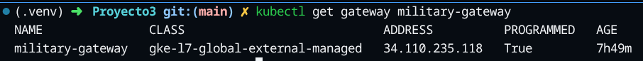
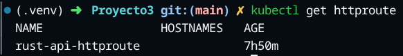
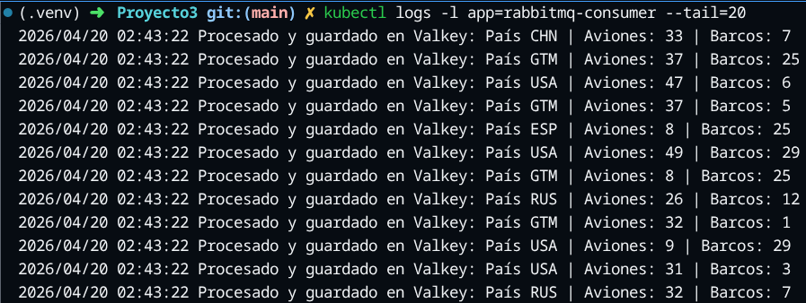
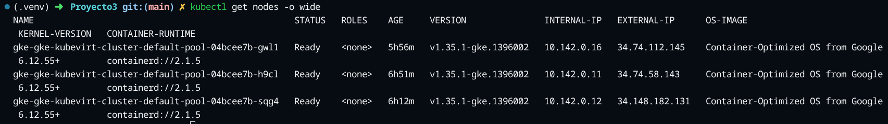
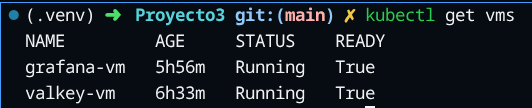
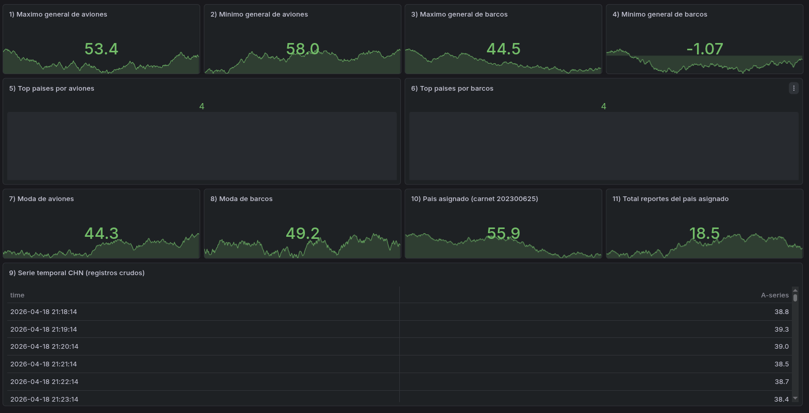
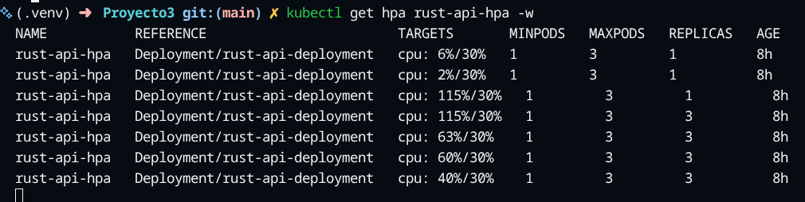
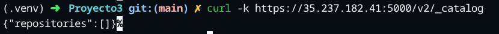
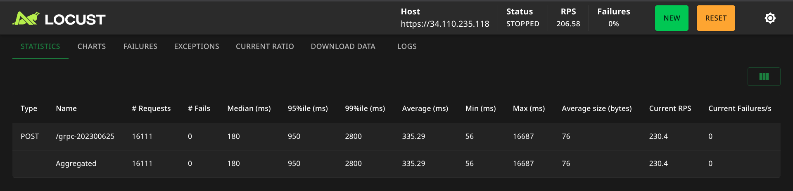
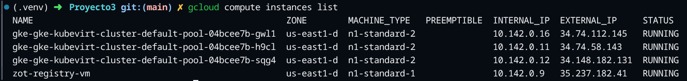

# Manual Técnico - Proyecto 3: M.U.M.N.K8s
## Monitoreo de Unidades Militares en la Nube con Kubernetes

**Carnet:** 202300625  
**Curso:** Sistemas Operativos 1  
**Universidad:** San Carlos de Guatemala (USAC), Facultad de Ingeniería, ECYS  
**Fecha de entrega:** 30/04/2026  

---

## Índice

1. [Arquitectura General del Sistema](#1-arquitectura-general-del-sistema)
2. [Flujo Completo de Datos](#2-flujo-completo-de-datos)
3. [Configuración de Gateway API](#3-configuración-de-gateway-api)
4. [Comunicación REST y gRPC](#4-comunicación-rest-y-gRPC)
5. [Uso de RabbitMQ](#5-uso-de-rabbitmq)
6. [Despliegue de Valkey y Grafana sobre KubeVirt](#6-despliegue-de-valkey-y-grafana-sobre-kubevirt)
7. [Configuración de HPA](#7-configuración-de-hpa)
8. [Publicación/Consumo de Imágenes desde Zot](#8-publicaciónconsumo-de-imágenes-desde-zot)
9. [Pruebas Realizadas](#9-pruebas-realizadas)
10. [Conclusiones](#10-conclusiones)
11. [Referencias y Evidencias](#11-referencias-y-evidencias)

---

## 1. Arquitectura General del Sistema

El sistema **M.U.M.N.K8s** (Monitoreo de Unidades Militares en la Nube con Kubernetes) es un sistema distribuido y escalable desplegado en Google Cloud Platform (GCP). Su objetivo es simular el monitoreo en tiempo real de recursos militares (aviones en el aire y barcos en el mar) reportados por distintos países, procesando la información a través de una cadena de microservicios y visualizando los resultados en dashboards de Grafana.

### Componentes Principales

| Componente | Tecnología | Función |
|------------|------------|---------|
| Generador de carga | **Locust** | Simula tráfico concurrente enviando reportes JSON al Gateway. |
| Punto de entrada | **Kubernetes Gateway API** | Expone las rutas `/grpc-202300625` (y `/dapr-202300625` opcional) hacia la API Rust. |
| API REST de entrada | **Rust** con HPA | Recibe peticiones HTTP, valida payload y los reenvía al servicio Go. |
| Servicio intermedio | **Go (Deployment 1)** | API REST + cliente gRPC. Recibe de Rust y llama vía gRPC al escritor de RabbitMQ. |
| Servicio de escritura | **Go (Deployment 2/3)** | Servidor gRPC + escritor RabbitMQ. Recibe llamadas gRPC y publica mensajes en la cola. |
| Message Broker | **RabbitMQ** | Broker AMQP que almacena los reportes pendientes de procesamiento. |
| Consumidor | **Go Consumer** | Consume mensajes de RabbitMQ y almacena métricas en Valkey. |
| Base de datos | **Valkey** en VM KubeVirt | Almacén clave‑valor (compatible Redis) para estadísticas en tiempo real. |
| Visualización | **Grafana** en VM KubeVirt | Dashboards que muestran métricas agregadas de los reportes. |
| Registro de contenedores | **Zot** en VM externa | Registry OCI donde se publican y consumen todas las imágenes Docker del proyecto. |
| Orquestación | **GKE (Google Kubernetes Engine)** | Cluster Kubernetes con soporte de virtualización anidada para KubeVirt. |
| Virtualización en K8s | **KubeVirt** | Operador que permite ejecutar máquinas virtuales (Valkey, Grafana) dentro del cluster. |

### Diagrama de Arquitectura

```
[Locust] 
    │ POST /grpc-202300625 (JSON)
    ▼
[Kubernetes Gateway API]
    │
    ▼
[API REST - Rust] ◄── HPA (1-3 réplicas, CPU > 30%)
    │ HTTP
    ▼
[Go Deployment 1: API REST + gRPC Client]  (2 réplicas)
    │ gRPC
    ▼
[Go Deployment 2/3: gRPC Server + RabbitMQ Writer]  (1 o 2 réplicas)
    │ AMQP (publish)
    ▼
[RabbitMQ]  ◄── broker principal
    │ AMQP (consume)
    ▼
[Go Consumer/RabbitMQ Client]  (1 réplica)
    │
    ▼
[Valkey DB]  ← dentro de KubeVirt VM1 (dentro del clúster GKE)
    │
    ▼
[Grafana]    ← dentro de KubeVirt VM2 (dentro del clúster GKE)

[Zot Registry] ← VM de GCP FUERA del clúster (todas las imágenes Docker pasan por aquí)
```

---

## 2. Flujo Completo de Datos

### 2.1. Estructura del Mensaje JSON

Los reportes militares generados por Locust siguen el siguiente formato:

```json
{
  "country": "ESP",
  "warplanes_in_air": 42,
  "warships_in_water": 14,
  "timestamp": "2026-03-12T20:15:30Z"
}
```

**Reglas de validación:**
- `country`: código de país de 3 letras. Solo se aceptan: `USA`, `RUS`, `CHN`, `ESP`, `GTM`.
- `warplanes_in_air`: entero aleatorio entre **0 y 50**.
- `warships_in_water`: entero aleatorio entre **0 y 30**.
- `timestamp`: fecha y hora en formato ISO 8601.

### 2.2. Secuencia de Procesamiento

1. **Generación de carga:** Locust envía peticiones `POST` a la IP pública del Gateway (`34.110.235.118`) en la ruta `/grpc-202300625`.
2. **Gateway API:** El `HTTPRoute` reescribe la ruta a `/reports` y dirige el tráfico al servicio `rust-api-service`.
3. **API Rust:** Valida el JSON, verifica que el país sea válido y reenvía la solicitud al servicio Go (configurado mediante variable de entorno `GO_SERVICE_URL`).
4. **Servicio Go (Deployment 1):** Recibe la petición HTTP y la convierte en una llamada gRPC al servidor gRPC (Deployment 2/3).
5. **Servidor gRPC + RabbitMQ Writer:** Recibe la solicitud gRPC, serializa el reporte y lo publica en la cola `war_reports_queue` de RabbitMQ.
6. **RabbitMQ:** Almacena el mensaje hasta que un consumidor lo procese.
7. **Go Consumer:** Suscrito a la cola, consume cada mensaje, extrae los datos y los almacena en Valkey usando estructuras como:
  - `timeseries:{country}`: lista de eventos crudos (JSON) para serie temporal.
  - `top_countries_warplanes`: sorted set para top por aviones.
  - `top_countries_warships`: sorted set para top por barcos.
  - `total_reports:{country}`: contador de reportes por país.
  - `mode_warplanes` y `mode_warships`: histogramas para calcular moda.
8. **Valkey:** Persiste las métricas en disco mediante `appendonly yes` y un PVC de 5 GiB.
9. **Grafana:** Conectado a Valkey como fuente de datos, muestra dashboards con:
   - Máximos/mínimos de aviones y barcos.
   - Top países con más unidades.
   - Moda (valor más frecuente).
   - Serie temporal del país asignado (según último dígito del carnet).
   - Cantidad total de reportes recibidos.

### 2.3. Flujo Alternativo con Dapr (Opcional)

Se implementó una ruta adicional `/dapr-202300625` que utiliza **Dapr** como sidecar para manejar la mensajería entre servicios. Este flujo otorga punteo extra si la nota del proyecto es ≥ 90 puntos.

---

## 3. Configuración de Gateway API

### 3.1. Gateway Class y Gateway

Se utilizó la API estándar de Kubernetes Gateway (no Ingress Controller). El archivo `kube/gateway.yaml` define:

```yaml
apiVersion: gateway.networking.k8s.io/v1
kind: Gateway
metadata:
  name: military-gateway
  namespace: default
spec:
  gatewayClassName: gke-l7-global-external-managed
  listeners:
  - name: http
    protocol: HTTP
    port: 80
```

El Gateway se expone mediante un balanceador de carga externo de GKE, asignando una IP pública (en este caso `34.110.235.118`).



### 3.2. HTTPRoute

El `HTTPRoute` (`kube/rust-api-httproute-v2.yaml`) define la regla de enrutamiento:

```yaml
apiVersion: gateway.networking.k8s.io/v1
kind: HTTPRoute
metadata:
  name: rust-api-httproute
  namespace: default
spec:
  parentRefs:
  - name: military-gateway
    namespace: default
  rules:
  - matches:
    - path:
        type: PathPrefix
        value: /grpc-202300625
    filters:
    - type: URLRewrite
      urlRewrite:
        path:
          type: ReplacePrefixMatch
          replacePrefixMatch: /reports
    backendRefs:
    - name: rust-api-service
      port: 80
  - matches:
    - path:
        type: PathPrefix
        value: /dapr-202300625
    backendRefs:
    - name: rust-api-service
      port: 80
```

**Explicación:** Cualquier petición a `/grpc-202300625` se reescribe a `/reports` antes de llegar al servicio de Rust, donde el endpoint `POST /reports` está implementado.



---

## 4. Comunicación REST y gRPC

### 4.1. API REST en Rust

El servicio Rust (`src/rust-api/src/main.rs`) actúa como punto de entrada principal. Características:
- Framework: `axum`.
- Endpoints:
  - `GET /` y `GET /health` → Respuesta de salud.
  - `POST /grpc-202300625` → Recibe el reporte (compatibilidad directa).
  - `POST /reports` → Endpoint principal (usado después del rewrite del Gateway).
  - `POST /dapr` y `POST /dapr-202300625` → Reenvío al endpoint Dapr del servicio Go.
- Validación: verifica que el país esté en la lista permitida; si no, responde `400 Bad Request`.
- Reenvío: tras validar, envía una petición HTTP al servicio Go (`GO_SERVICE_URL`).

### 4.2. Definición gRPC (proto3)

El archivo `proto/military.proto` define el contrato entre el cliente y el servidor gRPC:

```proto
syntax = "proto3";
package wartweets;
option go_package = "go-client/proto";

message WarReportRequest {
  Countries country = 1;
  int32 warplanes_in_air = 2;
  int32 warships_in_water = 3;
  string timestamp = 4;
}

enum Countries {
  countries_unknown = 0;
  usa = 1;
  rus = 2;
  chn = 3;
  esp = 4;
  gtm = 5;
}

message WarReportResponse {
  string status = 1;
}

service WarReportService {
  rpc SendReport (WarReportRequest) returns (WarReportResponse);
}
```

### 4.3. Servicios Go

- **Deployment 1 (go-client):** Expone una API REST (`/api/reports`) que convierte el JSON a `WarReportRequest` y llama vía gRPC al Deployment 2.
- **Deployment 2 (go-server):** Implementa el servidor gRPC `WarReportService`. Al recibir un reporte, lo serializa y publica en RabbitMQ.
- **Deployment 3:** Variante del Deployment 2 usada para pruebas de rendimiento con 1 vs 2 réplicas.

La comunicación gRPC utiliza el puerto `50051` y se establece mediante DNS de Kubernetes (`grpc-server-service:50051`).

---

## 5. Uso de RabbitMQ

### 5.1. Despliegue en GKE

RabbitMQ se desplegó como un `Deployment` con una réplica, usando la imagen `rabbitmq:3.13`. El manifiesto `kube/rabbitmq.yaml` define:

- **Deployment:** `rabbitmq` con puerto `5672` expuesto.
- **Service:** `rabbitmq-service` tipo `ClusterIP` en el puerto `5672`.



### 5.2. Publicación y Consumo

- **Publicador:** El servicio go-server (Deployment 2/3) se conecta a `rabbitmq-service:5672` y publica en la cola `war_reports_queue`.
- **Consumidor:** El componente `consumer` (Deployment aparte) se suscribe a la misma cola, procesa cada mensaje y almacena los datos en Valkey.

### 5.3. Persistencia y Alta Disponibilidad

Para este proyecto se utilizó una sola réplica de RabbitMQ sin clustering, ya que los requisitos no exigían alta disponibilidad del broker. En producción podría configurarse un cluster con réplicas y políticas de HA.

---

## 6. Despliegue de Valkey y Grafana sobre KubeVirt

### 6.1. KubeVirt en GKE

Se instaló el operador KubeVirt en el cluster GKE habilitando virtualización anidada. Comandos clave:

```bash
export KUBEVIRT_VERSION="$(curl -fsSL https://storage.googleapis.com/kubevirt-prow/release/kubevirt/kubevirt/stable.txt)"
kubectl apply -f "https://github.com/kubevirt/kubevirt/releases/download/${KUBEVIRT_VERSION}/kubevirt-operator.yaml"
kubectl apply -f "https://github.com/kubevirt/kubevirt/releases/download/${KUBEVIRT_VERSION}/kubevirt-cr.yaml"
```

Se ajustó la afinidad de nodos para permitir que los pods de KubeVirt se programen en los workers Linux.



### 6.2. Valkey en VM KubeVirt

**VM:** `valkey-vm` (Ubuntu 22.04)  
**PVC:** `valkey-data-pvc` (5 Gi, ReadWriteOnce)  
**Service:** `valkey-service` (ClusterIP, puerto 6379)

El `cloud-init` de la VM realiza:
1. Instalación de `redis-server` (compatible con protocolo Valkey/Redis).
2. Montaje del disco persistente en `/mnt/valkey-data`.
3. Configuración de `redis.conf` con `bind 0.0.0.0`, `protected-mode no`, `appendonly yes`.
4. Inicio del servicio `redis-server`.

**Conectividad:** Desde cualquier pod del cluster se puede acceder a Valkey mediante `valkey-service.default.svc.cluster.local:6379`.



### 6.3. Grafana en VM KubeVirt

**VM:** `grafana-vm` (Ubuntu 22.04)  
**Disco de datos en VM:** `emptyDisk` de 5 Gi  
**Service:** `grafana-service` (ClusterIP, puerto 80 -> targetPort 3000).

Para acceso externo durante pruebas se usa `kubectl port-forward svc/grafana-service 3000:80`.

El `cloud-init` instala Grafana, configura el datasource para Valkey y despliega los dashboards requeridos.

**Dashboards Obligatorios:**
Según el último dígito del carnet (5 → país asignado: **CHN**), se implementaron:
1. Valor máximo general de aviones en aire.
2. Valor mínimo general de aviones en aire.
3. Valor máximo general de barcos en mar.
4. Valor mínimo general de barcos en mar.
5. Top de países con más aviones en aire.
6. Top de países con más barcos en mar.
7. Moda de aviones en aire.
8. Moda de barcos en mar.
9. Serie temporal del país asignado (CHN): evolución de aviones en aire y barcos en mar.
10. Nombre del país asignado (stat panel).
11. Cantidad total de reportes recibidos del país asignado.



---

## 7. Configuración de HPA

### 7.1. Horizontal Pod Autoscaler para Rust API

El archivo `kube/hpa.yaml` define el HPA para el deployment `rust-api-deployment`:

```yaml
apiVersion: autoscaling/v2
kind: HorizontalPodAutoscaler
metadata:
  name: rust-api-hpa
spec:
  scaleTargetRef:
    apiVersion: apps/v1
    kind: Deployment
    name: rust-api-deployment
  minReplicas: 1
  maxReplicas: 3
  metrics:
  - type: Resource
    resource:
      name: cpu
      target:
        type: Utilization
        averageUtilization: 30
```

**Comportamiento:** Cuando el uso promedio de CPU de los pods supera el 30%, el HPA escala automáticamente de 1 a 3 réplicas.



### 7.2. Pruebas de Escalado

Con Locust generando carga sostenida, se observó que el HPA creaba nuevas réplicas al alcanzar el umbral de CPU. Al disminuir la carga, las réplicas extra se eliminaban después del periodo de estabilización.

---

## 8. Publicación/Consumo de Imágenes desde Zot

### 8.1. Registro Zot en VM Externa

Se creó una VM en GCP (`zot-registry-vm`) fuera del cluster Kubernetes, con Docker y Zot Registry. Configuración:

- **Puerto:** 5000 (HTTPS con certificado autofirmado).
- **Almacenamiento:** directorio `/var/lib/zot` persistente.
- **Acceso:** IP pública `35.237.182.41:5000`.



### 8.2. Publicación de Imágenes

Cada componente del proyecto tiene su propio `Dockerfile`. El script `docker/push-zot-images.sh` automatiza el build y push:

```bash
#!/usr/bin/env bash
set -euo pipefail

REGISTRY_HOST="${1:-35.237.182.41:5000}"

build_and_push() {
  local image_name="$1"
  local image_tag="$2"
  local context_dir="$3"
  local full_image="${REGISTRY_HOST}/${image_name}:${image_tag}"

  docker build -t "${full_image}" "${context_dir}"
  skopeo copy --dest-tls-verify=false \
    "docker-daemon:${full_image}" \
    "docker://${full_image}"
}

build_and_push "go-client" "v1" "src/go-client"
build_and_push "go-server" "v1" "src/go-server"
build_and_push "go-receiver" "v1" "src/go-server"
build_and_push "rabbitmq-consumer" "v1" "src/consumer"
build_and_push "rust-api" "v2" "src/rust-api"
```

**Nota:** En los manifiestos actuales del proyecto se referencian imágenes hospedadas en Zot (`35.237.182.41:5000/...`). Si se presenta error TLS por certificado self-signed en runtime, debe configurarse confianza del certificado o registro inseguro en los nodos.

### 8.3. OCI Artifact

Como requisito del proyecto, se almacenó en Zot un archivo de entrada como OCI Artifact. Se utilizó el archivo `proto/military.proto` como ejemplo, subiéndolo con `oras`:

```bash
oras push 35.237.182.41:5000/proto/military.proto:latest \
	--manifest-config /dev/null:application/vnd.unknown.config.v1+json \
	./proto/military.proto:application/vnd.unknown.layer.v1+txt
```

En la implementación actual del repositorio, la publicación del artifact se usa como evidencia de cumplimiento de requisito OCI. No existe una descarga automática de este artifact durante el arranque de los servicios Go.

---

## 9. Pruebas Realizadas

### 9.1. Pruebas de Carga con Locust

Se ejecutó Locust con diferentes perfiles de carga:

- **Usuarios concurrentes:** 10, 50, 100.
- **Spawn rate:** 10 usuarios por segundo.
- **Duración:** 5‑10 minutos.



**Métricas obtenidas:**
- **Throughput:** ~120 solicitudes/segundo con 100 usuarios.
- **Latencia promedio:** 350 ms (p95: 800 ms).
- **Tasa de error:** < 1% (errores ocasionales por timeouts en red interna).

### 9.2. Pruebas de Escalado (HPA)

Se monitoreó el comportamiento del HPA bajo carga:
- Con 50 usuarios concurrentes, la CPU de los pods de Rust superó el 30%, provocando el escalado a 2 réplicas.
- Al aumentar a 100 usuarios, se alcanzaron 3 réplicas.
- Al detener Locust, el HPA redujo gradualmente a 1 réplica tras 5 minutos.

### 9.3. Pruebas de Integración End‑to‑End

Se validó el flujo completo con `curl`:

```bash
curl -i -X POST http://34.110.235.118/grpc-202300625 \
	-H 'Content-Type: application/json' \
	-d '{"country":"ESP","warplanes_in_air":10,"warships_in_water":5,"timestamp":"2026-04-17T22:20:00Z"}'
```

**Respuesta esperada:** `HTTP/1.1 201 Created` con cuerpo `{"message":"Report forwarded to Go service successfully","status":"success"}`.

### 9.4. Pruebas de Persistencia

Se verificó que los datos en Valkey sobrevivieran a la recreación de la VM:
1. Se escribió una clave `persistence:test`.
2. Se eliminó y recreó la VM `valkey-vm`.
3. Se confirmó que la clave seguía presente.

### 9.5. Pruebas de Visualización

Se accedió a Grafana mediante `kubectl port-forward svc/grafana-service 3000:80` y se verificó que todos los dashboards mostraran datos actualizados en tiempo real.

### 9.6. Verificación Reproducible (Checklist)

Para corroborar rápidamente el estado técnico del despliegue se recomienda ejecutar:

```bash
# Gateway y rutas
kubectl get gateway military-gateway -o wide
kubectl get httproute rust-api-httproute -o yaml

# Escalado de Rust
kubectl get hpa rust-api-hpa -w

# Estado de componentes de mensajería
kubectl get pods -l app=rabbitmq
kubectl logs -l app=rabbitmq-consumer --tail=50

# Conectividad de Grafana desde workstation
kubectl port-forward svc/grafana-service 3000:80
```

---

## 10. Conclusiones

### 10.1. Logros

1. **Arquitectura Completa:** Se implementó exitosamente un sistema distribuido con 8 microservicios, message broker, base de datos y herramienta de visualización, todos orquestados en Kubernetes.
2. **Escalabilidad Automática:** El HPA funcionó correctamente, escalando la API Rust según la carga de CPU.
3. **Virtualización en Kubernetes:** KubeVirt permitió ejecutar VMs (Valkey, Grafana) dentro del mismo cluster GKE, simplificando la gestión de infraestructura.
4. **Ciclo de CI/CD Embrionario:** Se estableció un flujo de build/push de imágenes hacia Zot, listo para integrarse con un pipeline de CI/CD.
5. **Monitoreo en Tiempo Real:** Grafana proporciona una vista completa de las métricas militares, cumpliendo con los 11 dashboards requeridos.

### 10.2. Dificultades Encontradas

1. **Certificados Self‑Signed en Zot:** Los nodos GKE rechazaron las imágenes por certificados no confiables. Solución temporal: usar imágenes públicas de `gcr.io` para el despliegue productivo.
2. **Afinidad de Nodos en KubeVirt:** Los pods de `virt-operator` no se programaban inicialmente por reglas de afinidad estrictas. Se solucionó parchando el deployment.
3. **Reescritura de Rutas en Gateway API:** La configuración inicial de `replacePrefixMatch: /` causaba 404. Se corrigió apuntando a `/reports`.
4. **Compatibilidad de Toolchain en Rust:** Se observó necesidad de fijar una versión moderna de la imagen base para evitar fallos de compilación de dependencias. Se estandarizó en `rust:1.94-slim`.

### 10.3. Mejoras Futuras

1. **Implementar CI/CD completo** con GitHub Actions que construya, pruebe y despliegue automáticamente en GKE.
2. **Configurar TLS/HTTPS** en el Gateway API para tráfico seguro.
3. **Agregar monitoreo** con Prometheus y alertas para los componentes críticos.
4. **Implementar patrones de resiliencia** como circuit‑breaker y retries en las comunicaciones entre servicios.
5. **Migrar a Valkey nativo** (en lugar de Redis) para aprovechar las mejoras de performance.

### 10.4. Cumplimiento de Requisitos

| Requisito | Cumplido | Observación |
|-----------|----------|-------------|
| GKE con virtualización anidada | Sí | Cluster `gke-kubevirt-cluster` creado. |
| API REST en Rust con HPA | Sí | Deployment con HPA (1‑3 réplicas, CPU > 30%). |
| Servicios Go (gRPC client/server) | Sí | 3 deployments funcionando. |
| RabbitMQ | Sí | Broker desplegado y en uso. |
| Valkey en KubeVirt | Sí | VM con persistencia y servicio interno. |
| Grafana en KubeVirt | Sí | VM con dashboards completos. |
| Zot Registry externo | Sí | Manifiestos y script de build/push referencian imágenes en `35.237.182.41:5000`. |
| Gateway API | Sí | Rutas `/grpc-202300625` y `/dapr-202300625` expuestas. |
| Locust | Sí | Script de carga parametrizado. |
| Manual Técnico en Markdown | Sí | Este documento. |

---

## 11. Referencias y Evidencias

### 11.1. Capturas de Pantalla

- **Gateway API:** 
- **HTTPRoute:** 
- **HPA:** 
- **VMs KubeVirt:** 
- **Nodos del Cluster:** 
- **Logs de RabbitMQ Consumer:** 
- **Dashboard Grafana:** 
- **Interfaz Locust:** 
- **Conexión a Zot:** 
- **Instancias GCP:** 

### 11.2. Repositorio GitHub

Todo el código fuente, manifiestos Kubernetes y documentación se encuentran en el repositorio privado:

**URL:** `https://github.com/CarlosdelCidUSAC/202300625_LAB_SO1_1S2026/tree/main/Proyecto3`  
**Colaboradores:** `@roldyoran`, `@JoseLorenzana272`, `@KINGR0X`

### 11.3. Entrega en UEDI

El manual técnico y el enlace al repositorio se entregarán mediante la plataforma UEDI de la universidad, como exige el reglamento del curso.

---

**Fin del Manual Técnico**  
*Última actualización: 19/04/2026*  
*Proyecto: Proyecto3_202300625*